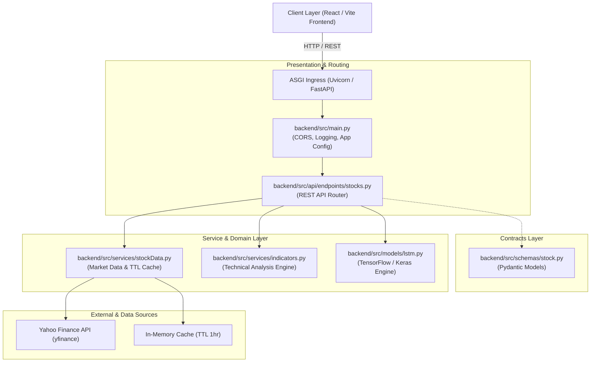

# S&P 500 Price Predictor — Backend Architecture & Technical Flow

This document provides a comprehensive technical walkthrough of the backend service powering the **S&P 500 Price Predictor**. It is designed for software architects, backend engineers, and technical interviewers who want to understand the system design, request lifecycle, data pipelines, and machine learning workflows.

---

## 1. System Architecture Overview

The backend is built with **FastAPI** running on top of the **Uvicorn** ASGI server. It follows a clean **modular layered architecture** where presentation, routing, domain services, machine learning, and data serialization are decoupled into distinct layers:



---

## 2. Codebase Navigation: Recommended File Reading Order

When explaining or reviewing the backend codebase with a technical colleague, follow this sequential reading order from outer infrastructure to core domain logic:

```
1. backend/main.py               --> Entrypoint & ASGI process initialization
2. backend/src/main.py           --> FastAPI application factory & middleware setup
3. backend/src/schemas/stock.py  --> Pydantic data contracts & validation schemas
4. backend/src/api/endpoints/stocks.py --> REST route definitions & controller logic
5. backend/src/services/stockData.py   --> Market data provider & TTL caching engine
6. backend/src/services/indicators.py  --> Quantitative indicators mathematical engine
7. backend/src/models/lstm.py    --> Deep learning model architecture & forecast pipeline
```

---

## 3. Component Deep Dive: File-by-File Technical Breakdown

### Step 1: `backend/main.py` — Server Entrypoint
- **Role**: Execution harness and path resolver.
- **Key Responsibilities**:
  - Dynamically adds `backend/` to `sys.path` to enable clean absolute package imports (`src.api`, `src.services`).
  - Launches Uvicorn ASGI server hosting `src.main:app` on `127.0.0.1:8000` with hot reload enabled for development.
- **Why start here**: It is the single entry point that boots the process and explains how the application environment is initialized.

---

### Step 2: `backend/src/main.py` — Application Factory & Ingress
- **Role**: Top-level FastAPI application assembly.
- **Key Responsibilities**:
  - Configures standard structured logging (`%(asctime)s [%(levelname)s] %(name)s: %(message)s`).
  - Instantiates `FastAPI(title="S&P 500 Price Predictor API", version="2.0.0")`.
  - Configures `CORSMiddleware` to permit cross-origin requests from the React dev server (`http://localhost:5173`) and production hosts.
  - Mounts the `stocksRouter` with the `/api` prefix.
  - Exposes `/` and `/health` endpoints for health checks and telemetry monitoring.

---

### Step 3: `backend/src/schemas/stock.py` — Data Contracts
- **Role**: Type safety and validation schemas built with Pydantic v2.
- **Key Models**:
  - `StockItem`: Basic profile model (`symbol`, `name`, `sector`).
  - `PriceSummary`: Latest quote snapshot (`current_price`, `change`, `change_pct`, `high_52w`, `low_52w`, `avg_volume`, `latest_date`).
  - `StockDetailResponse`: Composite response bundling `info`, `price_info`, and `returns` (1W, 1M, 3M, 1Y).
  - `PredictionRequest`: Validated input parameters for model training (`forecast_days`: 1–60, `epochs`: 3–50, `prediction_days`: 20–120).
  - `ModelMetrics`: Evaluation scores (`mae`, `mse`, `rmse`, `r2`).
  - `ForecastPoint`: Forecast record containing `date`, `predicted` value, and 95% confidence bounds (`lower`, `upper`).
  - `ForecastResponse`: Complete output schema containing model metrics and future price trajectory.
- **Why read schemas early**: Understanding the domain objects clarifies the inputs and outputs across all subsequent endpoints.

---

### Step 4: `backend/src/api/endpoints/stocks.py` — REST Controller Layer
- **Role**: Exposes RESTful endpoints, handles HTTP queries, and orchestrates services.
- **Endpoints Exposed**:
  1. `GET /api/stocks`:
     - Returns list of S&P 500 constituents.
     - Supports optional query parameters: `sector` and `search`.
  2. `GET /api/stocks/sectors`:
     - Returns distinct list of all 10 tracked market sectors.
  3. `GET /api/stocks/{symbol}`:
     - Returns company profile, price snapshot, 52W range, and trailing returns.
  4. `GET /api/stocks/{symbol}/history`:
     - Returns historical OHLCV records formatted for charting.
     - Supports dynamic timeframe filters: `1m`, `3m`, `6m`, `1y`, `2y`, `5y`, `all`.
  5. `GET /api/stocks/{symbol}/indicators`:
     - Computes all technical indicators over the price history.
     - Returns indicator summary and time-series data for the last 252 trading sessions.
  6. `POST /api/stocks/{symbol}/predict`:
     - Triggers LSTM model training on the fly and returns multi-day forward projections.
  7. `GET /api/stocks/{symbol}/export`:
     - Streams dynamic CSV or JSON file downloads with appropriate `Content-Disposition` headers.

---

### Step 5: `backend/src/services/stockData.py` — Data Access & In-Memory TTL Cache
- **Role**: Market data retrieval, constituent registry, and caching engine.
- **Key Capabilities**:
  - **Constituent Universe (`stockDatabase`)**:
    - Stores 119 curated S&P 500 market leaders across 10 sectors (Technology, Finance, Healthcare, Consumer, Energy, Industrial, Telecom, Real Estate, Utilities, Materials).
  - **In-Memory TTL Caching (`cacheStore`)**:
    - Cache entries stored as: `{ "data": DataFrame, "timestamp": float }`.
    - Default TTL: 3,600 seconds (1 hour).
    - Cache key format: `{symbol}_{startDate}_{endDate}`.
    - Eliminates redundant network calls to Yahoo Finance and prevents IP rate limits.
  - **Data Normalization & Cleaning**:
    - Unpacks `yfinance` MultiIndex headers when downloading single ticker datasets.
    - Forward-fills (`ffill()`) and back-fills (`bfill()`) missing trading day quotations.
  - **Trailing Returns Calculation (`calculateReturns`)**:
    - Computes percentage return across 1-Week (5 days), 1-Month (21 days), 3-Month (63 days), and 1-Year (252 days) trading windows.

---

### Step 6: `backend/src/services/indicators.py` — Quantitative Indicators Engine
- **Role**: Vectorized technical indicator computations using pandas and numpy.
- **Indicators Implemented**:
  - **SMA (Simple Moving Average)**: Rolling mean over customizable window (`period=20`, `period=50`).
  - **EMA (Exponential Moving Average)**: Exponentially weighted moving average with `adjust=False`.
  - **RSI (Relative Strength Index, 14 periods)**: Wilder's smoothed moving average of gains and losses.
  - **MACD (Moving Average Convergence Divergence)**:
    - Fast EMA (12) - Slow EMA (26).
    - Signal Line: 9-day EMA of MACD line.
    - MACD Histogram: Difference between MACD line and Signal line.
  - **Bollinger Bands (20 periods, 2 standard deviations)**: Upper band, middle SMA band, and lower band.
  - **ATR (Average True Range, 14 periods)**: Volatility measurement from maximum of high-low, high-prevClose, low-prevClose.
  - **OBV (On-Balance Volume)**: Cumulative volume directed by daily close price changes.
  - **Stochastic Oscillator (%K, %D)**: 14-period momentum relative to high-low range.
  - **Signal Interpretation (`getIndicatorSummary`)**:
    - Automatically classifies signals into `Bullish`, `Bearish`, `Neutral`, `Overbought`, or `Oversold`.

---

### Step 7: `backend/src/models/lstm.py` — Deep Learning Forecasting Pipeline
- **Role**: TensorFlow/Keras neural network for sequential time-series prediction.
- **Architecture**:
  ```python
  Sequential([
      LSTM(units=50, return_sequences=True, input_shape=(60, 1)),
      Dropout(0.2),
      LSTM(units=50, return_sequences=False),
      Dropout(0.2),
      Dense(units=25),
      Dense(units=1)
  ])
  ```
- **Pipeline Workflow**:
  ```mermaid
  sequenceDiagram
      autonumber
      participant Router as stocks.py
      participant Model as lstm.py
      participant TF as TensorFlow / Keras

      Router->>Model: trainAndForecast(data, predictionDays=60, forecastDays=15, epochs=10)
      Model->>Model: Validate minimum 100 rows of 'Close' prices
      Model->>Model: Normalize series using MinMaxScaler(0, 1)
      Model->>Model: Construct sliding windows: X = [t-60..t-1], y = [t]
      Model->>Model: Split 80% Train, 20% Test (Chronological holdout)
      Model->>TF: Compile Adam optimizer + MSE loss & fit model
      TF-->>Model: Trained weights
      Model->>Model: Evaluate holdout test set (Compute MAE, RMSE, R² Fit Score)
      Model->>Model: Autoregressive Rollout: Loop 1..N forecast days, feeding pred(t) into next batch
      Model->>Model: Invert scaling via scaler.inverse_transform()
      Model->>Model: Compute 95% Confidence Interval (± 1.96 * historical RMSE)
      Model-->>Router: Return dictionary with metrics and forecast points
  ```

---

## 4. End-to-End Request Flow Examples

### Flow A: Client Requests Stock Overview (`GET /api/stocks/NVDA`)
1. **Request**: React frontend triggers `GET /api/stocks/NVDA`.
2. **Routing**: FastAPI routes request to `getStock()` in `stocks.py`.
3. **Symbol Validation**: Symbol normalized to uppercase and checked against `stockDatabase`.
4. **Cache Lookup**: `loadStockData("NVDA")` checks `cacheStore`. If within 1 hour TTL, cached `DataFrame` is returned immediately; otherwise, `yfinance` fetches historical OHLCV data.
5. **Calculations**:
   - `getCurrentPriceInfo()` computes today's price, daily change, 52W extremes, and average volume.
   - `calculateReturns()` computes 1W, 1M, 3M, 1Y trailing performance.
6. **Serialization**: Bundled into `StockDetailResponse` Pydantic model and returned as HTTP 200 JSON.

---

### Flow B: Client Triggers AI Neural Prediction (`POST /api/stocks/NVDA/predict`)
1. **Request**: Frontend sends payload:
   ```json
   {
     "forecast_days": 15,
     "epochs": 10,
     "prediction_days": 60
   }
   ```
2. **Routing & Validation**: `stocks.py` validates request using `PredictionRequest` schema.
3. **Model Training**: `trainAndForecast()` executes in worker thread:
   - Scales closing prices.
   - Builds 60-day sequence tensor.
   - Trains 2-layer LSTM network for 10 epochs.
   - Computes validation metrics: MAE, RMSE, R².
4. **Recursive Inference**: Generates 15 forward days by appending each step's output to the sequence window.
5. **Confidence Corridor**: Calculates upper and lower bounds using empirical test error bounds.
6. **Response**: Returns HTTP 200 with `ForecastResponse` JSON containing projected dates, prices, and error metrics.

---

## 5. Architectural & Design Decisions

| Decision | Rationale |
|---|---|
| **In-Memory TTL Caching** | Prevents Yahoo Finance rate-limiting and reduces latency from ~800ms to <5ms for repeated views. |
| **FastAPI Synchronous Route Handlers** | Pandas, numpy, and TensorFlow operations are CPU-bound. Declaring endpoints as `def` (instead of `async def`) causes FastAPI to run them in an external threadpool, ensuring the event loop remains responsive. |
| **Pydantic Contracts** | Strict input/output validation prevents malformed requests and generates interactive OpenAPI docs automatically at `/docs`. |
| **Vectorized Technical Indicators** | Implemented using native pandas/numpy rolling operations for sub-millisecond execution times on 10-year datasets. |
| **Autoregressive Recursive Rollout** | Allows multi-step ahead projections while preserving sequential time dependencies without retraining per horizon. |
| **Strict Naming Standard** | Clean camelCase and descriptive variable names throughout the entire codebase, following repository guidelines. |

---

## 6. How to Run & Test the Backend Locally

### 1. Activate Environment & Run
```powershell
cd d:\Learnings\ai_stock_prediction\backend
python main.py
```
- Server boots on: `http://127.0.0.1:8000`
- Interactive OpenAPI Swagger UI: `http://127.0.0.1:8000/docs`
- Health check endpoint: `http://127.0.0.1:8000/health`

### 2. Sample cURL Test Commands
```bash
# Check service health
curl http://127.0.0.1:8000/health

# List S&P 500 technology stocks
curl "http://127.0.0.1:8000/api/stocks?sector=Technology"

# Retrieve NVDA price detail and returns
curl http://127.0.0.1:8000/api/stocks/NVDA

# Compute technical indicators
curl http://127.0.0.1:8000/api/stocks/NVDA/indicators

# Execute LSTM forecast
curl -X POST http://127.0.0.1:8000/api/stocks/NVDA/predict \
  -H "Content-Type: application/json" \
  -d '{"forecast_days": 15, "epochs": 10, "prediction_days": 60}'
```
